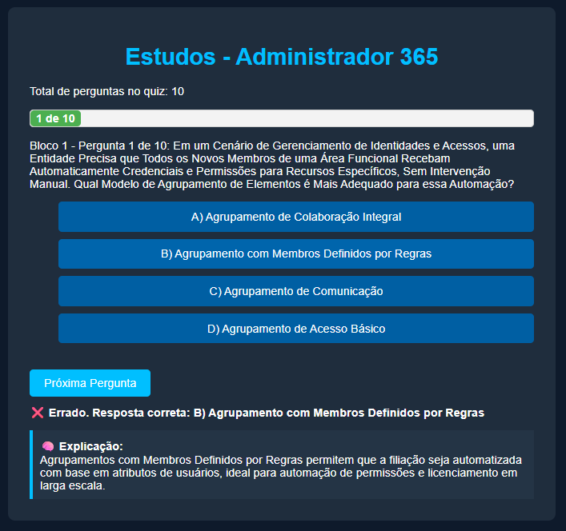
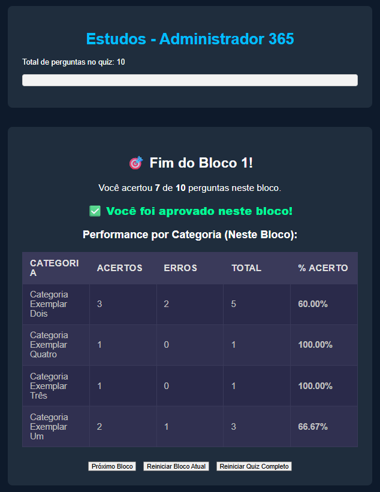

# Simulador de Estudos – Administrador 365

Simulador interativo para estudos práticos e revisão de conceitos relacionados à administração de ambientes Microsoft 365. Desenvolvido com HTML, CSS e JavaScript puro, o projeto apresenta questões fictícias e abstratas, focadas em raciocínio técnico, segurança, conformidade e governança de identidade — inspirado em desafios enfrentados por administradores de ambientes corporativos baseados em nuvem.

## 🎯 Objetivo

Oferecer uma ferramenta gratuita e leve para fixação de conteúdos técnicos, sem qualquer vínculo com provas oficiais ou questões reais da Microsoft.

## 🚀 Recursos

- Interface responsiva e leve  
- Perguntas exibidas em ordem aleatória a cada execução  
- Alternativas embaralhadas automaticamente em cada pergunta  
- Barra de progresso com feedback em tempo real  
- Explicação automática após cada resposta  
- Resumo de desempenho ao final de cada bloco (acertos, erros, % por categoria)  
- Compatível com GitHub Pages  

## ⚠️ Aviso Legal

Este conteúdo é totalmente fictício e criado com fins educacionais. Nenhuma das perguntas representa exames oficiais da Microsoft. Este simulador é independente e não possui qualquer vínculo com a Microsoft.

## 📦 Como usar

1. Clone ou baixe este repositório  
2. Abra o arquivo `index.html` no navegador  
3. Personalize suas próprias questões no arquivo `perguntas.json`, com base nas suas anotações de estudo. Mantenha o mesmo formato de estrutura.  
4. (Opcional) Publique com [GitHub Pages](https://pages.github.com/) para acesso online  

## 🖼️ Demonstração

### 💡 Exemplo de pergunta com explicação automática:

### ✅ Tela de resultado por bloco:

